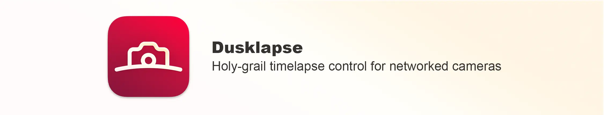

<p align="center">
  <a href="https://dusklapse.com"></a>
  <a href="https://dusklapse.com"></a>
</p>

## Introduction

Dusklapse is an app for creating day-to-night or night-to-day time-lapses (the so-called Holy Grail) using DSLR / DSLM cameras.

The app connects to your camera via Wi-Fi and adjusts your camera’s exposure time, aperture and ISO settings to pre-defined limits, enabling you to capture time-lapse footage with significant changes in light, such as from day to night or vice versa.

## Issues and Contributing

Dusklapse is currently still at a very early stage and is not yet stable. If you encounter any problems, you can create an [issue](https://github.com/gr3enk/dusklapse/issues). All issues and feedback help to improve Dusklapse.

If you would like to contribute to the project, please read [contributing guide](./CONTRIBUTING.md).

## Developer Guide

### Prerequisites

- **Rust**, installed through [rustup](https://rustup.rs/). Not through Homebrew: `brew install rust`
  puts a `cargo` on your `PATH` that has no cross-compilation targets, and building for iOS then
  fails with `can't find crate for core` no matter what you add with `rustup target add`. If you
  already have one, `brew uninstall rust`.
- **Node 22** and **pnpm**. The version is pinned in `package.json`, so `corepack enable` is enough
  to get the right one.
- **Platform toolchain**, depending on what you want to run:
    - _macOS / iOS_: Xcode with its command line tools.
    - _Linux_: `libwebkit2gtk-4.1-dev`, `libgtk-3-dev`, `librsvg2-dev` and `patchelf`. Tauri links
      against the system WebView, so these are needed to compile at all, not only to package.
    - _Windows_: the WebView2 runtime, which ships with Windows 11.

### Getting started

```bash
git clone https://github.com/gr3enk/dusklapse.git
cd dusklape

pnpm install
pnpm tauri dev
```

That builds the Rust side and opens the app as a desktop window. The first build takes a few
minutes; later ones are incremental.

### Running it without a camera

You almost certainly do not own the camera a given change touches, and you do not need to. Pick
**Mock** in the vendor list on the connect screen. It is a simulated camera that runs in-process,
needs no address, and produces frames. Everything downstream of the connection works against it:
the histogram, the luminance measurement, the ramp and the charts.

It is also what to point a reviewer at, and what the ramp's end-to-end test drives.

### Running it on an iPhone or iPad

```bash
pnpm tauri ios dev

# or with a specific simulator:
pnpm tauri ios dev "iPad Pro 11-inch (M5)"
```

Two things are specific to this repository:

**The development team in `src-tauri/tauri.conf.json` is not yours.** Override it for your own
builds rather than editing the file:

```bash
APPLE_DEVELOPMENT_TEAM=YOURTEAMID pnpm tauri ios dev
```

**Do not run `tauri ios init`.** The generated Xcode project is committed and carries two patches
that the command would silently overwrite: `buildPhase: none` on the `Externals` source group,
without which a 398 MB `libapp.a` is copied into the app bundle and App Store validation rejects
it, and the release configuration's signing settings. The release workflow checks for both, but it
is easier not to lose them.

### Before opening a pull request

CI runs these five, and each is a separate check:

```bash
pnpm lint          # ESLint
pnpm typecheck     # tsc --noEmit
pnpm test          # Vitest
cd src-tauri && cargo clippy --all-targets -- -D warnings && cd ..
cd src-tauri && cargo test && cd ..
```

Formatting is Prettier for the web side and rustfmt for Rust, both behind one command:

```bash
pnpm format
```

### Project layout

| Path             | What lives there                                                                                                                                              |
| ---------------- | ------------------------------------------------------------------------------------------------------------------------------------------------------------- |
| `src/`           | The React frontend. No camera I/O happens here - it all goes through Tauri commands.                                                                          |
| `src-tauri/src/` | The Rust backend: camera protocols, the exposure ramp, image analysis.                                                                                        |
| `docs/`          | The documentation site. Its own pnpm project with its own lockfile - `cd docs && pnpm install`. For more information see the [docs README](./docs/README.md). |

Camera support is a strategy pattern: `src-tauri/src/camera/mod.rs` holds the `Camera` trait and
the registry, and each vendor is a module beside it. Adding one means writing that module and
naming it in two places in `mod.rs`; nothing in the frontend knows which vendor is connected.

## Camera Vendors and Models

Dusklapse supports the following camera manufacturers:

| Vendor    | Status                   |
| --------- | ------------------------ |
| Canon     | planned for the future   |
| Nikon     | under active development |
| Panasonic | planned for the future   |
| Sony      | planned for the future   |

A detailed list of supported models can be found [here](https://www.dusklapse.com/docs/cameras)

## License

Licensed under either of

- Apache License, Version 2.0 ([LICENSE-APACHE](LICENSE-APACHE) or <https://www.apache.org/licenses/LICENSE-2.0>)
- MIT license ([LICENSE-MIT](LICENSE-MIT) or <https://opensource.org/licenses/MIT>)
